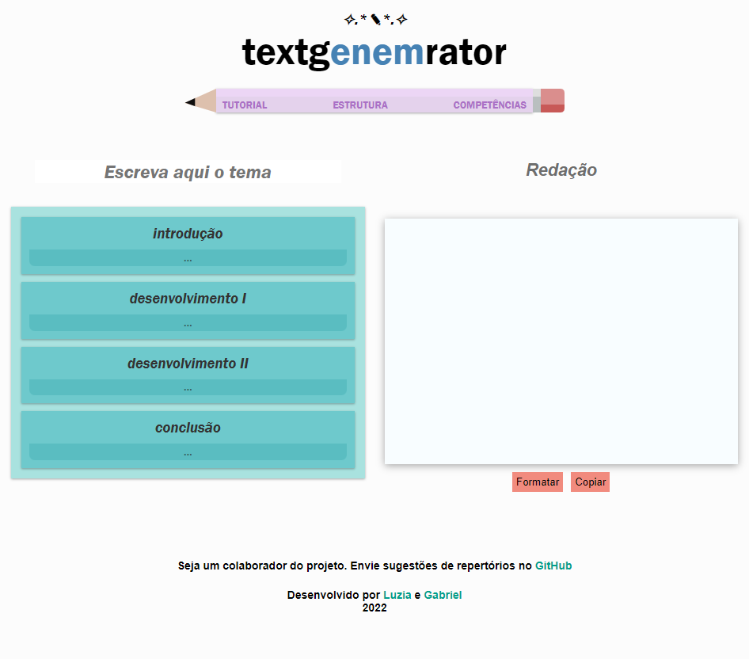

<h1 align="center">
  gENEMsis
   
  

  

</h1>
<h4 align="center">
  Uma interativa biblioteca de repertórios para gerar redações no modelo do vestibular brasileiro ENEM.
</h4>

  <a href="#key-features">Key Features</a> •
  <a href="#como-usar">Como Usar</a> •
  <a href="#créditos">Créditos</a> •
  <a href="#licença">Licença</a>

  

## Key Features

* Funciona em navegadores web;
* Responsivo (adaptado a computadores e celulares);
* Necessário acesso à internet.

## Como Usar

* Seleção de blocos e edição de texto.

Após selecionar os repertórios desejados, um clique na caixa branca gera o esqueleto da redação. O modelo pode ser formatado, editado e copiado para estudo de um tema específico. A ideia é disponibilizar repertórios e agilizar a produção de texto, sem tirar a essência do processo criativo. 

>

## Créditos

- [Badges](https://github.com/mkenney/software-guides/blob/master/STABILITY-BADGES.md)

## Suporte

Contribua com a melhoria do projeto enviando repertórios e/ou códigos no Pull request.  

</a>

## Licença

Open-source

---

